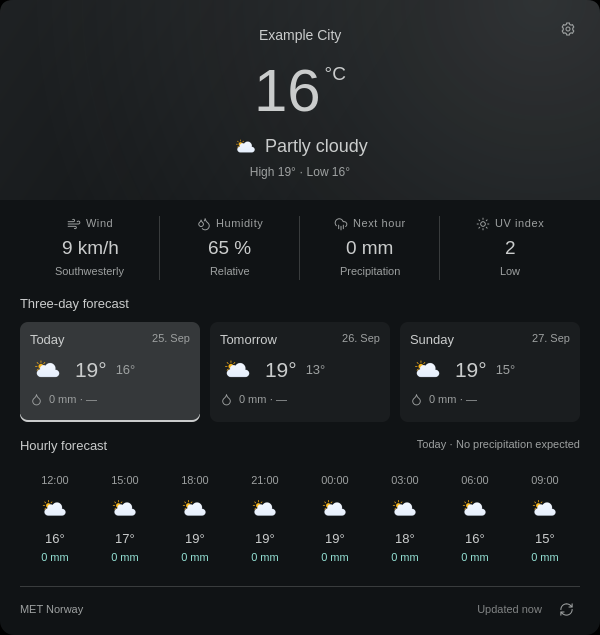

# Foamy Weather

Current weather and a three-day forecast.



## Install

Requires Omarchy Quattro, Bash, `curl`, `jq`, `awk`, GNU coreutils, and
internet access for forecasts and location search.

For automatic location, install GeoClue (`geoclue`).
Disable another weather widget before enabling this one.

```sh
omarchy plugin add https://github.com/foamrider/foamy-weather.git --enable
```

## Use

1. Left-click the widget and open the settings cog.
2. Search for a location and select a result.
3. Choose language, units, and whether to animate the background.

Left-click opens the forecast, middle-click refreshes, and right-click shows a
summary. Select a day to see its hourly forecast. **Use location data** enables
optional automatic positioning; it is off by default.

Forecast responses are limited to 2 MiB and each sunrise response to 64 KiB
after decompression. Invalid or oversized responses are rejected; a valid
cached forecast remains available when a refresh fails.

Forecast and automatic-location requests wait briefly after connection and retry temporary failures up to three times with increasing delays. Reconnecting resets the retry budget and resumes refreshes automatically; existing forecast data remains visible during an outage.

Coordinates travel between processes through stdin rather than command-line
arguments. Cache names use opaque hashes, with existing caches read through
private file descriptors. Location and forecast caches remain owner-only.
Coordinates are still sent to MET Norway and, for automatic place names, OpenStreetMap.

## Remove

```sh
omarchy plugin remove foamy.weather
```

When removing an enabled replacement, Omarchy restores `omarchy.weather`.
Location settings, forecast preferences, and cached forecasts remain on disk.
Some settings are shared with the stock weather plugin; retain them if you
intend to use it. GeoClue remains installed.

Omarchy manages the plugin entry in `shell.json`. Packages and data outside
the plugin directory are retained unless you remove them separately.

## License

Weather: [MET Norway](https://www.met.no/), [CC BY 4.0](https://creativecommons.org/licenses/by/4.0/).
Search: [Open-Meteo](https://open-meteo.com/) / GeoNames.
Automatic location names: [OpenStreetMap contributors](https://www.openstreetmap.org/copyright).

Code: [MIT](LICENSE). Third-party notices:
[Omarchy](LICENSE-OMARCHY), [Atmosphere](LICENSE-ATMOSPHERE),
[Meteocons](LICENSE-METEOCONS), and [Lucide](LICENSE-LUCIDE).

Provided **as is**, without warranty or guaranteed support. Use at your own risk.
